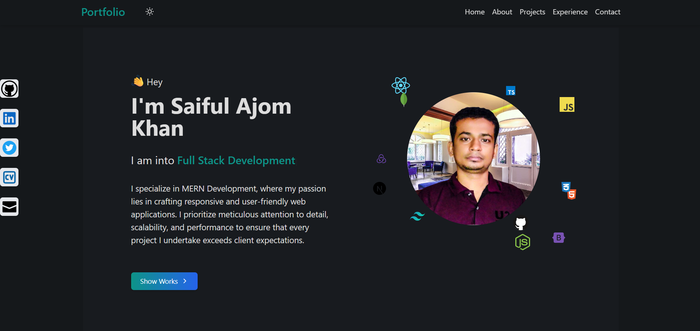

# Full Stack Protfolio App with Next.js, Tailwindcss, Node.js & MongoDB
### Full Mobile Responsive App

#### Go to Live Project: https://portfolio-saiful-ajom-khan.netlify.app/

### Full Mobile Responsive Web Page

#### It includes 3 Parts:
* Client with Next.js
* Admin with Vite
* Server with Node.js and MongoDB

### What I use here:
* React- Next.js
* Tailwindcss
* Node.js
* Express.js
* MongoDB
* React Toastfy
